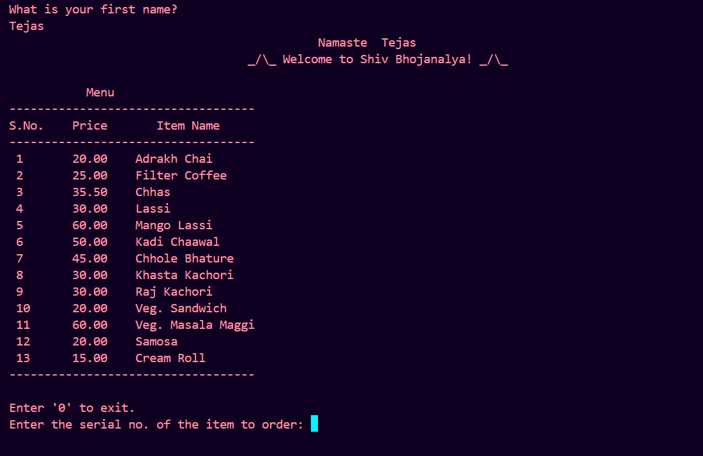
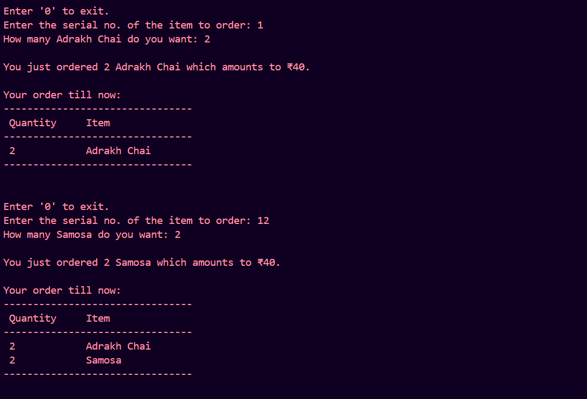
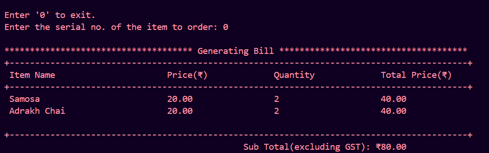
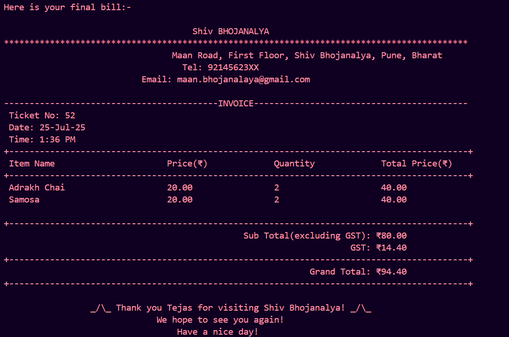

# 🍽️ Shiv Bhojanalya - Terminal-Based Food Ordering System

Welcome to **Shiv Bhojanalya**, a terminal-based restaurant simulation built in Go that allows users to place orders, view real-time billing, and receive a final invoice—all within the command-line interface.

This project mimics the real-world experience of a restaurant with personalization, menu display, dynamic subtotal updates, and final bill generation with GST.

---

## ✅ Features

- 🙏 Personalized welcome message
- 📋 Interactive food menu with serial numbers and prices
- 🧠 Maintains customer orders dynamically using Go maps
- 🧾 Displays subtotal after each order
- 📊 Final invoice with subtotal, GST, and grand total
- 🧵 Clean and formatted terminal output
- 🎉 Thank you message with user's name

---
## 📸 Screenshots

Here are some glimpses of the **Shiv Bhojanalya** CLI application:

| 🙏 Welcome Message | 🛒 Placing Orders |
| :---: | :---: |
|  |  |

| 📋 Generating Bill | 🧾 Final Invoice |
| :---: | :---: |
|  |  |

---


## 🚀 How to Run

### Step 1: Make sure Go is installed

Download Go from: [https://golang.org/dl](https://golang.org/dl)

### Step 2: Open terminal in project folder

Navigate to the root folder `Order-Food`.

### Step 3: Run the program

```bash
go run .
